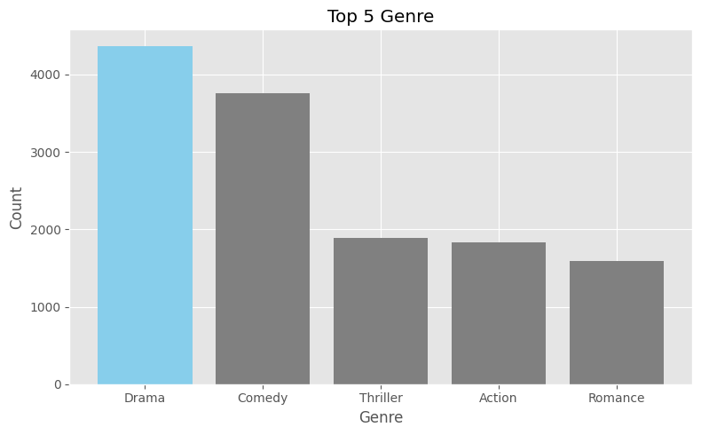
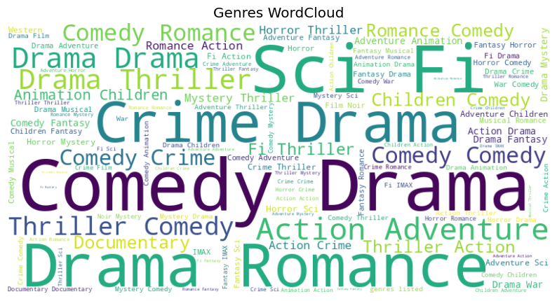
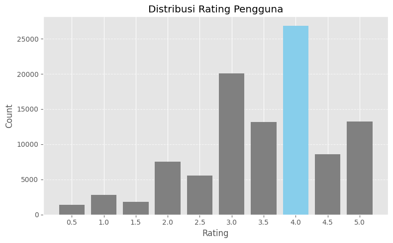
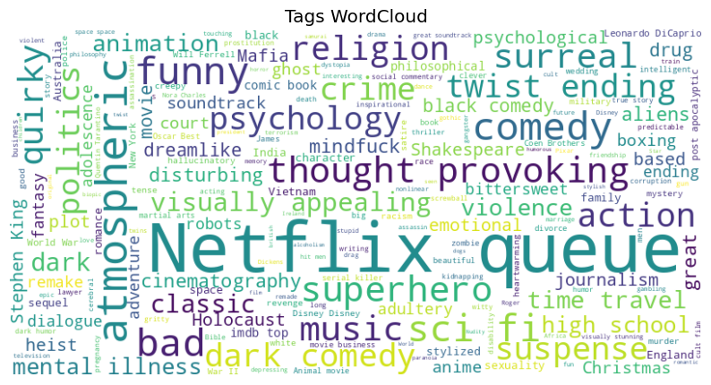
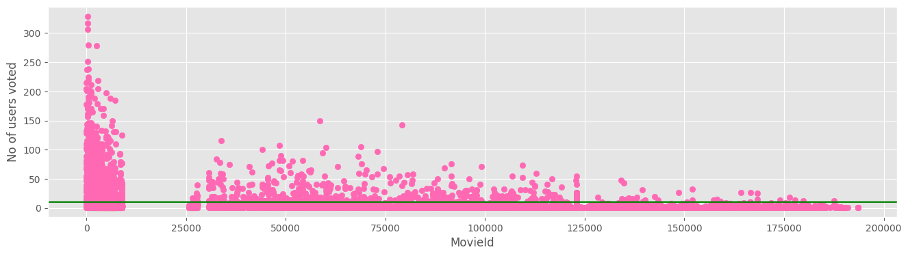
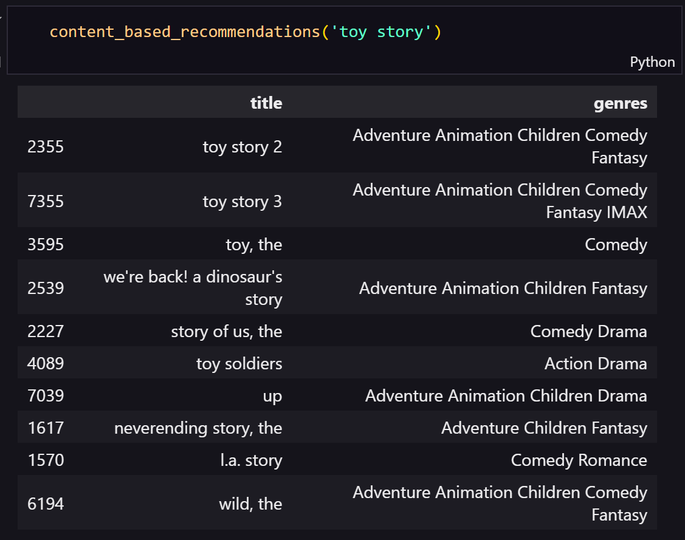
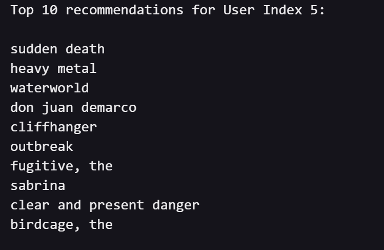

# Laporan Proyek Machine Learning - Gusti Ayu Putu Erika Erlina

## Project Overview

Dalam era digital saat ini, pengguna dihadapkan pada lonjakan besar konten hiburan, terutama dalam bentuk film dan serial yang tersedia di berbagai platform seperti Netflix, Disney+, Amazon Prime, dan lainnya. Data menunjukkan bahwa **Netflix merilis lebih dari 1.500 jam konten orisinal baru setiap tahunnya** (Statista, 2022), yang menciptakan fenomena *choice overload*, di mana pengguna justru merasa kewalahan dengan banyaknya pilihan. Studi dari Nielsen (2021) menemukan bahwa **66% pengguna kesulitan memutuskan konten yang ingin ditonton**, dan **21% dari mereka akhirnya tidak memilih apa pun**. Masalah ini menunjukkan bahwa memiliki konten yang melimpah tidak cukup dan platform perlu membantu pengguna menyaring dan menemukan konten yang relevan, di sinilah sistem rekomendasi memainkan peran penting.

Dari sudut pandang bisnis, kegagalan dalam menyediakan rekomendasi yang tepat dapat berdampak langsung pada kepuasan pelanggan dan tingkat retensi. Laporan McKinsey (2021) menyebutkan bahwa personalisasi konten, termasuk rekomendasi film yang relevan, dapat **meningkatkan pendapatan digital hingga 15% dan efisiensi pemasaran sebesar 30%**. Sementara itu, sekitar **75% tontonan di Netflix berasal dari sistem rekomendasi mereka** (Gomez-Uribe & Hunt, 2016), menandakan bahwa pengalaman pengguna dan strategi bisnis sangat dipengaruhi oleh keberhasilan sistem ini. Dalam pasar yang semakin kompetitif, platform yang gagal menghadirkan pengalaman personal berisiko kehilangan pelanggan ke pesaing yang menawarkan interaksi yang lebih cerdas dan adaptif.

Namun, merancang sistem rekomendasi yang efektif juga memiliki tantangan tersendiri. Dari sisi pengguna, sistem harus mampu memahami preferensi yang seringkali tidak eksplisit, sementara dari sisi konten, sistem harus dapat menyesuaikan rekomendasi seiring bertambahnya film dan perubahan tren. Permasalahan klasik seperti *cold start* (kurangnya data pengguna baru), *data sparsity* (data interaksi pengguna yang terbatas), dan *over-specialization* (rekomendasi terlalu sempit) menjadi hambatan nyata dalam pengembangan sistem ini. Maka dari itu, pengembangan sistem rekomendasi yang berbasis data dan adaptif bukan hanya menjadi fitur tambahan, melainkan strategi inti untuk mendorong pertumbuhan bisnis, memperkuat loyalitas pelanggan, dan mempertahankan daya saing platform hiburan digital.


### Daftar Pustaka:

* Gomez-Uribe, C. A., & Hunt, N. (2016). The Netflix Recommender System: Algorithms, Business Value, and Innovation. *ACM Transactions on Management Information Systems (TMIS)*, 6(4), 1–19. [https://doi.org/10.1145/2843948](https://doi.org/10.1145/2843948)
* McKinsey & Company. (2021). *The future of personalization—and how to get ready for it*. [https://www.mckinsey.com/business-functions/growth-marketing-and-sales/our-insights/the-future-of-personalization-and-how-to-get-ready-for-it](https://www.mckinsey.com/business-functions/growth-marketing-and-sales/our-insights/the-future-of-personalization-and-how-to-get-ready-for-it)
* Nielsen. (2021). *The Gauge: Streaming Usage Continues to Surge as Consumers Embrace the New Normal*. [https://www.nielsen.com/us/en/insights/report/2021/the-gauge-july-2021](https://www.nielsen.com/us/en/insights/report/2021/the-gauge-july-2021)
* Statista. (2022). *Number of original content hours released by Netflix worldwide from 2012 to 2022*. [https://www.statista.com/statistics/882221/netflix-original-content-hours/](https://www.statista.com/statistics/882221/netflix-original-content-hours/)


## Business Understanding:

### Problem Statements:

1. **Tingginya tingkat ketidakpuasan pengguna akibat rekomendasi film yang tidak relevan**

   Banyak pengguna platform hiburan digital seperti layanan streaming mengeluhkan bahwa rekomendasi yang diberikan tidak mencerminkan preferensi mereka yang sebenarnya. Hal ini dapat menyebabkan penurunan tingkat kepuasan dan loyalitas pengguna.

2. **Meningkatnya risiko *churn rate* akibat kurangnya personalisasi pengalaman pengguna**

   Dalam era personalisasi, pengguna memiliki ekspektasi tinggi terhadap pengalaman yang disesuaikan. Kurangnya sistem rekomendasi yang efektif membuat pengguna mudah berpaling ke platform lain yang mampu memberikan pengalaman yang lebih sesuai.

3. **Rendahnya tingkat eksplorasi katalog film yang berdampak pada potensi pendapatan yang belum dimanfaatkan**

   Sebagian besar pengguna hanya mengonsumsi konten populer dan jarang menjelajahi konten yang kurang dikenal. Hal ini menyebabkan film-film dalam “long tail” tidak dimonetisasi secara optimal, padahal potensi ekonominya besar jika distribusi konten dapat dioptimalkan.


## Goals

1. **Meningkatkan relevansi rekomendasi film bagi pengguna secara personal**

   Dengan menghadirkan sistem yang memahami preferensi individu, platform dapat memberikan rekomendasi yang lebih akurat dan meningkatkan kepuasan pengguna secara signifikan.

2. **Mengurangi tingkat kehilangan pengguna (user churn) melalui pendekatan personalisasi**

   Sistem rekomendasi yang baik dapat meningkatkan retensi pengguna dengan memberikan pengalaman yang unik dan sesuai selera, mendorong mereka untuk terus menggunakan layanan secara berkelanjutan.

3. **Mendorong eksplorasi konten dan monetisasi katalog film secara lebih merata**

   Dengan rekomendasi yang kontekstual dan cerdas, pengguna didorong untuk menonton film yang kurang populer namun relevan, sehingga meningkatkan potensi pendapatan platform dan optimalisasi katalog yang tersedia.

## Solution Statements

### Solution Approach 1: *Content-Based Filtering dengan Cosine Similarity*

Sistem ini merekomendasikan film berdasarkan kemiripan atribut film yang disukai pengguna sebelumnya (genre, kata kunci, deskripsi). Dengan *cosine similarity*, sistem dapat mengukur sejauh mana dua film mirip secara kontekstual.

* **Kelebihan**: Solusi ini cocok untuk pengguna baru yang belum banyak berinteraksi dengan sistem karena rekomendasi dapat dibangun hanya berdasarkan data film yang pernah mereka sukai. Ini membantu mempercepat *onboarding* pengguna baru dan mengurangi *early churn*.

### Solution Approach 2: *Collaborative Filtering dengan LightFM*

*LightFM* merupakan algoritma hibrida yang menggabungkan *user-item interactions* dan *metadata* (fitur konten), sehingga mampu menangani keterbatasan dari metode kolaboratif murni dan konten murni.

* **Kelebihan**: Dengan memanfaatkan interaksi antar pengguna dan fitur konten sekaligus, platform dapat memberikan rekomendasi yang dinamis dan lebih akurat. Ini membantu mempertahankan pengguna aktif dan memaksimalkan konsumsi konten dari berbagai segmen pengguna.

## Data Understanding
### Summary of MovieLens Small (Latest Version) Dataset

**Dataset**: [MovieLens Small Latest Dataset on Kaggle](https://www.kaggle.com/datasets/shubhammehta21/movie-lens-small-latest-dataset)

MovieLens Small (Latest Version) merupakan dataset film yang terdiri dari empat file utama: `movies.csv`, `ratings.csv`, `tags.csv`, dan `links.csv`. File `movies.csv` memuat informasi  tentang ID film, judul, dan genre (seperti Action, Drama, Comedy, dll) yang dipisahkan oleh tanda pipe (`|`). File `ratings.csv` mencatat interaksi pengguna terhadap film dalam bentuk rating skala 0.5 hingga 5.0, disertai timestamp. Sementara itu, `tags.csv` menyimpan tag bebas yang diberikan pengguna kepada film sebagai bentuk anotasi tambahan, juga dengan penanda waktu. File `links.csv` berfungsi sebagai penghubung film ke sumber eksternal seperti IMDb dan TMDb menggunakan ID yang sesuai.


---

## 🎬 Struktur File `movies.csv`

| Kolom   | Tipe Data | Deskripsi                                                                 | Contoh                        |
|---------|-----------|---------------------------------------------------------------------------|-------------------------------|
| movieId | Integer   | ID unik untuk setiap film, konsisten di seluruh file (ratings, tags, links, movies). | 1                             |
| title   | String    | Judul film, termasuk tahun rilis dalam tanda kurung.                      | Toy Story (1995)             |
| genres  | String    | Daftar genre film, dipisahkan oleh simbol pipe. | Adventure\|Animation\|Children |

### 🎭 Daftar Genre yang Tersedia:
`Action`, `Adventure`, `Animation`, `Children's`, `Comedy`, `Crime`, `Documentary`, `Drama`, `Fantasy`, `Film-Noir`, `Horror`, `Musical`, `Mystery`, `Romance`, `Sci-Fi`, `Thriller`, `War`, `Western`, `etc`

---

## ⭐ Struktur File `ratings.csv`

| Kolom     | Tipe Data | Deskripsi                                                                                     | Contoh     |
|-----------|-----------|-----------------------------------------------------------------------------------------------|------------|
| userId    | Integer   | ID unik dari pengguna yang memberikan rating. Konsisten dengan tags.csv.                      | 10         |
| movieId   | Integer   | ID film yang diberi rating (terhubung ke movies.csv).                                         | 1          |
| rating    | Float     | Nilai rating dari 0.5 hingga 5.0 dalam kelipatan 0.5.                                         | 4.0        |
| timestamp | Integer   | Waktu dalam format Unix timestamp (detik sejak 1 Januari 1970 UTC).                          | 964982703  |

📌 **Catatan**:
- File ini diurut berdasarkan `userId`, lalu `movieId`.
- Setiap baris mewakili satu interaksi rating satu film oleh satu pengguna.

---

## 🏷️ Struktur File `tags.csv`

| Kolom     | Tipe Data | Deskripsi                                                                                     | Contoh     |
|-----------|-----------|-----------------------------------------------------------------------------------------------|------------|
| userId    | Integer   | ID pengguna yang memberikan tag. Konsisten dengan ratings.csv.                                | 10         |
| movieId   | Integer   | ID film yang diberi tag. Konsisten dengan file lain.                                          | 1          |
| tag       | String    | Teks tag pendek yang dibuat pengguna, biasanya 1 kata/frase pendek.                           | Pixar      |
| timestamp | Integer   | Waktu penandaan dalam format Unix timestamp.                                                  | 1443148531 |

📌 **Catatan**:
- Baris diurut berdasarkan `userId`, lalu `movieId`.
- Tag bersifat bebas dan ditentukan oleh interpretasi pengguna.

---

## 🔗 Struktur File `links.csv`

| Kolom   | Tipe Data | Deskripsi                                                                                         | Contoh       |
|---------|-----------|---------------------------------------------------------------------------------------------------|--------------|
| movieId | Integer   | ID film (sama dengan yang ada di file lainnya, misalnya movies.csv).                              | 1            |
| imdbId  | String    | ID film pada situs IMDb. Format: 7 digit, dapat digunakan di URL: `https://imdb.com/title/tt[imdbId]`. | tt0114709    |
| tmdbId  | Integer   | ID film pada The Movie Database (TMDb), digunakan untuk mengakses data di themoviedb.org.         | 862          |

---
**Tahapan memahami data**:

* Melakukan univariate analysis pada data untuk mengevaluasi distribusi tiap fitur.

   * **Movies variable**:

      * **Melakukan pengecekan tipe data dan banyak kolom**

         Berdasarkan hasil pengecekan maka dapat diketahui movieId bertipe data int64, title dan genres bertipe object. Serta tercatat terdapat 3 kolom dalam variabel ini.

      * **Melakukan pengecekan 5 data pertama**

         Berdasarkan preview 5 data pertama, tidak terlihat adanya duplikat data.

      * **Melakukan pengecekan unique data dalam judul dan genre**

         Terdapat sebanyak 9737 judul film dan genre film sebanyak 951.

      * **Melihat summary statistics data**
      
         Total movie id terdapat sebanyak 9742 data, dengan nilai id terkecil 1 dan max adalah 193609. Terdapat 9742 data title dan genre yang tercatat.

      * **Melakukan pengecekan missing values dan duplikat**

         Tidak terdapat missing values dan juga duplikat dalam variabel movies.

      * **Memvisualisasikan top 5 genre**

         

         Visualisasi Top 5 Genre menggunakan barchart akan memberikan insights mengenai genre film yang paling populer berdasarkan jumlah kemunculannya. Dari grafik ini, bisa diidentifikasi preferensi umum pengguna terhadap kategori tertentu, seperti “Drama” atau “Comedy”, yang sering kali menempati peringkat atas. Hal ini sangat penting, karena dapat digunakan untuk menyusun rekomendasi yang relevan dengan selera mayoritas atau untuk merancang kampanye pemasaran bertema genre populer di musim tertentu (misalnya, horor menjelang Halloween).

      * **Memvisualisasikan genre wordcloud**

         

         Visualisasi wordcloud untuk genres memperluas pemahaman terhadap keragaman genre di seluruh dataset. Wordcloud menyajikan kata (genre) dengan ukuran yang proporsional terhadap frekuensi kemunculannya, sehingga secara visual mudah mengidentifikasi genre mana yang dominan dan mana yang jarang muncul, seperti genre drama, comedy sering muncul dan genre action jarang muncul. Ini bermanfaat untuk melihat apakah katalog film yang tersedia cukup beragam atau terlalu terpusat pada genre tertentu.

   * **Ratings variable**:

      * **Melakukan pengecekan tipe data dan banyak kolom**

         Berdasarkan hasil pengecekan maka dapat diketahui movieId, userId, dan timestamp bertipe int64, lalu rating bertipe float64. Serta tercatat terdapat 4 kolom dalam variabel ini.

      * **Melakukan pengecekan 5 data pertama**

         Dari 5 data pertama yang ditampilkan terlihat bahwa satu user mampu menonton dan memberikan rating lebih dari 1 film.

      * **Melakukan pengecekan macam-macam rating dan jumlahnya**

         Tercatat rating film memiliki 10 macam tipe rating, yaitu: 4.0, 5.0, 3.0, 2.0, 1.0, 4.5, 3.5, 2.5, 0.5, dan 1.5.

      * **Melihat summary statistics**

         - Terdapat 100836 data dalam userId, dengan nilai minimal 1 dan maksimal 610.
         - Terdapat 100836 data dalam movieId, dengan nilai minimal 1 dan max 193609.
         - Terdapat 100836 data dalam rating, dengan nilai minimal 0.5 dan max 5.
         - Terdapat 100836 data dalam timestamp, timestamp masih belum dalam format yang benar dan perlu diubah.

      * **Melakukan pengecekan missing values dan duplikat**

         Tidak terdapat missing values dan duplikat yang tercatat.

      * **Memvisualisasikan distribusi rating pengguna**

         

         Visualisasi distribusi rating dengan barchart menunjukkan bagaimana pengguna memberikan penilaian terhadap film, dari skala 0.5 hingga 5.0. Dari grafik ini, kita bisa melihat kecenderungan bahwa pengguna lebih sering memberi rating tinggi seperti 3.0, 4.0, dan 5.0 dibanding rating rendah. Hal ini menunjukkan kualitas konten yang disukai pengguna relatif tinggi.

   * **Tags variable**:

      * **Melakukan pengecekan tipe data dan banyak kolom**

         Berdasarkan hasil pengecekan maka dapat diketahui movieId, userId, dan timestamp bertipe data int64, tag bertipe object. Serta tercatat terdapat 4 kolom dalam variabel ini.

      * **Melakukan pengecekan 5 data pertama**

         Dari 5 bari pertama, tidak terlihat adanya duplikat values atau data.
      
      * **Melakukan pengecekan macam-mcam tag film dan jumlahnya**

         Terdapat 1589 unique tags yang tercatat, seperti funny, gun fu, dan will ferrell.

      * **Melihat summary statistics**

         - Terdapat 3683 data userId yang tercatat, dengan userId terkecil 2 dan terbesar 610.
         - Terdapat 3683 data movieId yang tercatat, dengan nilai terkecil 1 dan max 193565.
         - Terdapat 3683 data tag yang tercatat, dengan nilai unique 1589.
         - Terdapat 3683 data timestamp yang tercatat, tetapi formatnya masih salah.

      * **Melakukan pengecekan missing values dan duplikat**

         Tidak terdapat missing values maupun data duplikat yang tercatat.

      * **Memvisualisasikan tags wordcloud**
      
         

         Visualisasi tags wordcloud memberikan gambaran tentang istilah atau kata kunci yang sering digunakan oleh pengguna dalam memberikan tag ke film. Ini memperlihatkan minat atau asosiasi populer yang dimiliki pengguna terhadap film tertentu, misalnya “Netflix”, “thriller”, atau “classic”.

      * **Memvisualisasikan top 5 tag**

         

         Sementara itu, top 5 tags dalam bentuk barchart menunjukkan tag spesifik yang paling sering digunakan pengguna, yaitu "In Netflix Queue", "atmospheric". Berbeda dari wordcloud yang bersifat eksploratif, barchart memberikan informasi kuantitatif yang lebih jelas dan terukur.
      
   * **Links variable**:

      * **Melakukan pengecekan tipe data dan banyak kolom**

         Berdasarkan hasil pengecekan maka dapat diketahui movieId dan imdbId bertipe data int64, tmdbId bertipe float64. Serta tercatat terdapat 3 kolom dalam variabel ini.
      
      * **Melakukan pengecekan 5 data pertama**

         Dari 5 data pertama yang terlihat, tidak terdapat duplikat values.
      
      * **Melihat summary statistics**

         - Terdapat movieId yang tercatat sebanyak 9742 data, dengan nilai minimal 1 dan max 193609.
         - Terdapat imdbId yang tercatat sebanyak 9742.
         - Terdapat tmdbId yang tercatat sebanyak 9734.

      * **Melakukan pengecekan missing values dan duplikat**

         Terdapat missing values dalam data tmdbId sebanyak 8 dan tidak terdapat duplikat value yang tercatat.

   * **visualization of movie ids and the num of users voted**

      

      Visualisasi jumlah user yang memberikan rating terhadap setiap movie ID (movie\_ids vs. users voted) memperlihatkan id film mana yang paling sering dinilai oleh pengguna. Ini membantu mengidentifikasi film populer, yang bisa menjadi titik awal dalam sistem rekomendasi kolaboratif. Kemudian, jika film tertentu memiliki jumlah rating yang jauh lebih rendah, mungkin perlu dilakukan eksposur tambahan atau evaluasi terhadap relevansinya dengan audiens.


## Data Preparation

1. **Convert data type**:
   ```python
   tags.timestamp = pd.to_datetime(tags.timestamp, unit='s')
   ratings.timestamp = pd.to_datetime(ratings.timestamp, unit='s')
   ```

   Langkah pertama yang dilakukan adalah mengubah kolom timestamp pada dataset tags dan ratings menjadi tipe waktu (datetime) menggunakan fungsi `pd.to_datetime()`. Konversi ini bertujuan agar data waktu dapat dimanipulasi dan dianalisis lebih mudah, seperti dalam analisis tren waktu, segmentasi berdasarkan tahun, bulan, atau hari, serta pengurutan kronologis.

2. **Make title to be lowercase**:

   ```python
   movies['title'] = movies.title.str.lower()
   ```

   Semua judul film (movies['title']) diubah menjadi huruf kecil (lowercase). Ini dilakukan untuk menghindari perbedaan hasil ketika melakukan pencarian atau pencocokan string yang sensitif terhadap huruf kapital. Misalnya, “Titanic” dan “titanic” akan dianggap berbeda jika tidak diseragamkan. Langkah ini penting terutama ketika akan dilakukan pemrosesan teks seperti TF-IDF, karena metode tersebut bersifat case-sensitive.

3. **Clean year of the movie from titles**:

   ```python
   movies['title'] = movies['title'].str.replace(r'\(\d{4}\)', '', regex=True).str.strip()
   movies['title'] = movies['title'].str.replace(r'\(\d{4}(–\d{4})?\)', '', regex=True).str.strip()
   ```

   Selanjutnya dilakukan pembersihan tahun rilis film dari judul menggunakan regular expression `(\(\d{4}\)` atau `\(\d{4}(–\d{4})?\))`. Hal ini diperlukan karena data tahun yang menempel pada judul dapat mengganggu akurasi dalam model berbasis teks, seperti TF-IDF atau sistem rekomendasi konten, yang akan menganggap angka tahun sebagai kata penting padahal tidak merepresentasikan isi film.

4. **Clean genres from separator -> `|`**:

   ```python
   movies['genres'] = movies['genres'].str.replace(r"[\[\]']", "", regex=True).str.replace("|", " ")
   ```

   Data pada kolom genres dibersihkan dari karakter |, tanda kurung, dan tanda kutip yang tidak relevan. Genre yang semula dipisahkan dengan | diubah menjadi format yang lebih dapat diproses, seperti pemisahan dengan spasi. Langkah ini membantu saat teks genre akan digabung dengan judul atau dianalisis menggunakan metode berbasis teks.

5. **Concate title and genre**:

   ```python
   movies['title_genre'] = movies['title'] + ' ' + movies['genres']
   ```

   Penggabungan kolom title dan genres menjadi kolom baru title_genre bertujuan untuk menciptakan representasi teks gabungan yang mencerminkan konten dan kategori film. Ini sangat berguna untuk sistem rekomendasi berbasis konten (content-based filtering), karena memungkinkan model mengenali film yang serupa berdasarkan deskripsi teks gabungan.

6. **Drop duplicates and null values if it's exist in choosen variable for modeling**:

   Setelah beberapa tahap preparation dilakukan, variabel yang dipilih untuk proses modeling atau cosine similarity harus melalui tahap pembersihan data dari missing values dan data duplikat. Hal ini dilakukan untuk memastikan kualitas data yang digunakan dalam pelatihan model. Missing values dapat mengganggu proses training, menyebabkan error, atau menghasilkan prediksi yang bias. Sedangkan duplikat dapat menyebabkan over-representasi informasi tertentu dan mempengaruhi distribusi data.

7. **Vectorize title_genre**:

   ```python
   tfidf = TfidfVectorizer(stop_words='english')
   tfidf_matrix = tfidf.fit_transform(movies['title_genre'])
   ```

   Setelah data teks bersih, dilakukan vektorisasi dengan metode TF-IDF (TfidfVectorizer) untuk mengubah teks menjadi representasi numerik yang dapat dibaca oleh algoritma machine learning. Kolom `title_genre` dipilih karena kolom ini lebih deskriptif dibandingkan kolom genre dan judul saja. Kemudian, TF-IDF memperhatikan frekuensi kemunculan kata dan memberikan bobot lebih besar pada kata-kata yang unik dalam dokumen.

8. **Encode user and item for collaborative filtering**:

   ```python
   user_enc = LabelEncoder()
   item_enc = LabelEncoder()
   ratings['user'] = user_enc.fit_transform(ratings['userId'])
   ratings['item'] = item_enc.fit_transform(ratings['movieId'])
   ```

   Data pengguna (userId) dan film (movieId) diencoding menggunakan LabelEncoder untuk menghasilkan nilai numerik yang dapat digunakan dalam sistem rekomendasi berbasis collaborative filtering. Encoding ini diperlukan karena sebagian besar algoritma machine learning tidak dapat memproses data non-numerik secara langsung. 

9. **Split Data for Collaborative Filtering**:

   ```python
   train_df, test_df = train_test_split(ratings, test_size=0.4, random_state=42)
   ```

   Tahap terakhir dalam data preparation adalah membagi data menjadi data latih dan data uji menggunakan train_test_split. Pembagian ini bertujuan untuk mengevaluasi performa model dengan data yang belum pernah dilihat sebelumnya. 


## Modeling:

### **Content Based Filtering**:
Model mempelajari fitur dari film itu sendiri, bukan dari interaksi pengguna secara eksplisit. Representasi film dibentuk menggunakan gabungan antara judul dan genre (title_genre) yang telah diproses sebelumnya melalui metode vektorisasi TF-IDF. Hasil dari proses vektorisasi ini adalah tfidf_matrix, sebuah matriks berdimensi m × n, di mana m adalah jumlah film dan n adalah jumlah kata unik yang tersaring setelah stopwords dihapus.

Untuk menghitung kemiripan antar film, digunakan fungsi `cosine_similarity(tfidf_matrix, tfidf_matrix)`. Fungsi ini akan menghasilkan sebuah matriks kemiripan berukuran m × m, yang berisi nilai cosine similarity antara satu film dengan film lainnya berdasarkan fitur teks yang telah diolah. Cosine similarity dipilih karena mampu mengukur sejauh mana dua vektor berada dalam arah yang sama tanpa dipengaruhi oleh panjang vektor tersebut. Ini sangat cocok untuk data teks seperti kombinasi judul dan genre yang telah diubah ke bentuk vektor TF-IDF, karena metode ini menilai kemiripan dari isi/konten, bukan dari frekuensi absolut.

* **Cara Kerja Cosine Similarity dalam Sistem Rekomendasi**:

   Secara umum, cosine similarity bekerja dengan menghitung cosine dari sudut antara dua vektor dalam ruang berdimensi tinggi. Rumusnya adalah:

     $$
     \cos(\theta) = \frac{A \cdot B}{\|A\| \|B\|}
     $$

   di mana A dan B adalah vektor representasi dari dua film. Nilai similarity berada pada rentang [0, 1], di mana 1 menunjukkan dua film sangat mirip (vektor searah), dan 0 berarti tidak ada kemiripan. Setelah menghitung cosine similarity untuk semua pasangan film, kita dapat memilih Top-N film dengan nilai tertinggi sebagai rekomendasi. Misalnya, jika pengguna menyukai film "The Matrix", maka sistem akan mencari film-film dengan kemiripan konten tertinggi terhadap "The Matrix" dan menampilkannya sebagai rekomendasi.

* **Top-k rekomendasi**:
   

* **Kelebihan Content-Based Filtering dengan Cosine Similarity**:

   Pendekatan ini memiliki beberapa kelebihan penting. Pertama, metode ini tidak bergantung pada data pengguna lain, sehingga cocok untuk kasus cold-start user — pengguna baru yang belum memiliki histori interaksi. Kedua, model ini bisa memberikan rekomendasi yang konsisten dengan preferensi pengguna karena hanya melihat konten dari item yang disukai. Ketiga, cosine similarity efisien dan mudah diimplementasikan, serta dapat digunakan untuk dataset dalam skala besar jika dikombinasikan dengan teknik optimasi vektor.

* **Kekurangan Content-Based Filtering dengan Cosine Similarity**:

   Meski efisien, pendekatan ini juga memiliki kekurangan. Salah satunya adalah terbatasnya keragaman rekomendasi: karena hanya merekomendasikan item yang serupa dengan yang telah disukai, pengguna mungkin akan terus mendapatkan saran yang sangat mirip (masalah serendipity rendah). Selain itu, model ini tidak bisa menangkap hubungan kompleks antar pengguna dan item seperti pada collaborative filtering. Terakhir, kualitas rekomendasi sangat bergantung pada kualitas fitur teks—jika informasi yang digunakan (judul dan genre) terlalu sempit, maka sistem mungkin gagal menangkap nuansa konten yang lebih dalam.


### **Collaborative Based Filtering**:

* **Build Interaction Matrices**:

   Fungsi `build_interaction_matrix()` digunakan untuk membangun interaction matrix dari data pengguna dan item berdasarkan kolom rating. Matriks interaksi ini dibentuk menggunakan `coo_matrix` dari pustaka `scipy.sparse`, yang merupakan representasi sparse matrix atau matriks jarang. Fungsi ini menerima data frame dan kolom untuk pengguna, item, serta rating, lalu membangun matriks dua dimensi berukuran `(num_users x num_items)`, di mana setiap elemen berisi nilai rating dari pengguna terhadap suatu item. Langkah ini diperlukan karena algoritma seperti LightFM membutuhkan input dalam bentuk matriks interaksi untuk belajar dari pola interaksi pengguna-item. Menggunakan sparse matrix juga efisien secara memori, karena sebagian besar kombinasi pengguna-item tidak memiliki interaksi (nilai nol).


* **Mendefinisikan Dimensi Matriks dengan Jumlah Pengguna dan Item**:

   Variabel `num_total_users` dan `num_total_items` dihitung dari jumlah kelas unik hasil `LabelEncoder`, yang berarti kita telah memastikan bahwa encoding untuk `user` dan `item` telah dilakukan dengan menyeluruh pada dataset. Langkah ini agar bentuk matriks interaksi mencerminkan seluruh ruang interaksi potensial, termasuk yang belum terjadi (nilai 0 pada sparse matrix).

* **Melatih Model Rekomendasi dengan LightFM**:

   LightFM adalah algoritma yang menggabungkan collaborative filtering dan content-based filtering. Dirancang secara khusus untuk menangani data sparse, seperti yang sering ditemukan dalam sistem rekomendasi nyata.

   ```python
   model = LightFM(loss='warp')
   model.fit(train_interaction, epochs=50, num_threads=2)
   ```

   Digunakan Weighted Approximate-Rank Pairwise (WARP) sebagai loss function. WARP cocok untuk optimasi ranking, bukan hanya prediksi rating, yang berarti model ini tidak hanya belajar memprediksi nilai rating, tetapi juga mengurutkan item yang paling relevan bagi pengguna.

   Jumlah epoch yang terlalu kecil bisa menyebabkan model belum cukup belajar, sementara jumlah yang terlalu besar bisa membuat model menghapal data (overfit). 50 epoch memberi ruang yang cukup bagi model untuk belajar hubungan laten antara user dan item dari data sparse, tanpa mengorbankan waktu komputasi secara berlebihan.

   Melatih model LightFM bersifat multithreaded secara native, artinya bisa dilatih lebih cepat jika beberapa thread CPU digunakan. Dengan `num_threads=2`, pelatihan dapat dilakukan dua kali lebih cepat dibandingkan satu thread, tanpa membebani sistem terlalu berat (cocok untuk penggunaan lokal/laptop).

* **Top-k rekomendasi**:

   ```python
   print(f'Top 10 recommendations for User Index 5:\n')
   movies_titles = recommend_items(model, train_interaction, user_id=5, item_labels=item_enc, movies_df=movies, n=10)
   for i in range(len(movies_titles)):
      print(movies_titles[i])
   ```

   


* **Kelebihan LightFM**:

   * **Kombinasi CF dan Content-Based:** LightFM dapat memanfaatkan informasi side-feature (fitur pengguna atau item) jika tersedia. Ini membuatnya lebih kuat dibanding collaborative filtering murni.
   * **Cocok untuk data sparse:** Matrix yang jarang interaksi (seperti data rating pada film atau produk) tetap bisa dipelajari dengan baik oleh LightFM.
   * **WARP loss mendukung ranking:** Alih-alih hanya memprediksi rating, WARP membantu dalam mengurutkan item yang paling mungkin disukai pengguna, sesuai dengan tujuan sistem rekomendasi.
   * **Fast training:** LightFM dibangun untuk performa cepat di CPU dengan support multi-threading (`num_threads=2`).

* **Kekurangan LightFM:**:

   * **Tidak menangani cold-start secara penuh:** Jika pengguna atau item benar-benar baru dan tidak memiliki interaksi sebelumnya, performa model akan menurun (meskipun bisa ditangani sebagian jika menggunakan metadata tambahan).
   * **Hyperparameter sensitive:** Hasil yang baik sangat tergantung pada pemilihan jumlah epoch, jenis loss, dan parameter regularisasi.
   * **Memerlukan proses encoding eksplisit:** Data kategorik seperti userId dan movieId harus diencode terlebih dahulu sebelum dapat digunakan.


## Evaluation:

* **Evaluate Content Based Filtering**:

   Fungsi `precision_recall_content_based` bertujuan untuk mengukur kualitas hasil rekomendasi dalam sistem berbasis konten menggunakan dua metrik evaluasi yang umum digunakan, yaitu precision dan recall.

   ```markdown
   Precision@10 for 'toy story': 0.52
   Recall@10 for 'toy story': 1.00
   Precision@10 for 'grumpier old men': 0.43
   Recall@10 for 'grumpier old men': 1.00
   ```

   Hasil evaluasi menggunakan metrik content-based menunjukkan bahwa sistem rekomendasi memiliki performa yang cukup baik dalam menyarankan film yang mirip dengan preferensi pengguna. Untuk film Toy Story, nilai Precision\@10 sebesar 0.52 mengindikasikan bahwa lebih dari separuh rekomendasi teratas memiliki kemiripan konten yang tinggi, sementara Recall\@10 sebesar 1.00 menunjukkan bahwa seluruh kemiripan yang relevan berhasil ditangkap dalam 10 rekomendasi tersebut. Begitu pula pada film Grumpier Old Men, sistem mencapai Precision\@10 sebesar 0.43, artinya hampir setengah dari rekomendasi teratas sangat relevan, dan dengan Recall\@10 sebesar 1.00, seluruh informasi relevan tetap berhasil dijangkau.


* **Cara Kerja dan Formula**:

   1. **Transformasi Input dan Rekomendasi ke Vektor TF-IDF:**

      * Input judul film dan daftar film rekomendasi diubah menjadi representasi vektor spasial menggunakan TF-IDF (Term Frequency–Inverse Document Frequency).
      * Ini memungkinkan model menghitung kemiripan semantik antar judul dan genre film yang telah digabungkan sebelumnya.

   2. **Cosine Similarity:**

      * Kemiripan antara input dan setiap rekomendasi diukur dengan cosine similarity yang memberikan nilai antara 0 (tidak mirip) dan 1 (sangat mirip).
      * Rumus cosine similarity:

      $$
      \cos(\theta) = \frac{A \cdot B}{\|A\| \|B\|}
      $$

      di mana $A$ adalah vektor input dan $B$ adalah vektor dari masing-masing film yang direkomendasikan.

   3. **Precision\@K:**

      * Dalam fungsi ini, precision dihitung sebagai:

      $$
      \text{Precision@K} = \frac{\sum \text{Top-K Similarity Scores}}{K}
      $$
      * Ini memberikan nilai rata-rata kemiripan dari rekomendasi k teratas. Metrik ini menjelaskan seberapa “dekat” secara konten rekomendasi teratas terhadap input pengguna.

   4. **Recall:**

      * Recall diukur sebagai:

      $$
      \text{Recall@K} = \frac{\sum \text{Top-K Similarity Scores}}{\sum \text{All Similarity Scores}}
      $$
      * Ini menunjukkan proporsi total kemiripan (keseluruhan relevansi yang berhasil ditangkap oleh K rekomendasi teratas). Jika semua skor kemiripan hanya terkonsentrasi pada top-K, maka recall akan mendekati 1.

* **Kesimpulan:**

   Metrik precision dan recall dalam konteks content-based recommendation ini tidak mengukur “benar” atau “salah” secara eksplisit, melainkan seberapa relevan (berdasarkan kemiripan konten) rekomendasi terhadap preferensi input pengguna. Precision menunjukkan akurasi pada rekomendasi teratas, sedangkan recall menilai seberapa banyak informasi relevan berhasil ditangkap oleh rekomendasi tersebut. 

---

* **Evaluate Collaborative Based Filtering**:

   Dalam sistem rekomendasi berbasis collaborative filtering, evaluasi model umumnya dilakukan menggunakan metrik Precision\@K dan AUC (Area Under the Curve), yang memberikan gambaran seberapa baik model dalam merekomendasikan item yang relevan kepada pengguna.

   ```markdown
   Train Precision@10: 0.3618
   Test Precision@10: 0.1679
   Train AUC: 0.9694
   Test AUC: 0.9170
   ```

   Berdasarkan hasil evaluasi model dengan metrik Precision\@10 dan AUC, diperoleh bahwa Precision\@10 pada data latih sebesar 0.3618 dan pada data uji sebesar 0.1679, yang menunjukkan bahwa sekitar 36% dari 10 rekomendasi teratas di data latih dan 17% di data uji adalah item yang relevan bagi pengguna. Sementara itu, AUC pada data latih sebesar 0.9694 dan pada data uji sebesar 0.9170, mengindikasikan bahwa model memiliki kemampuan sangat baik dalam membedakan item relevan dan tidak relevan secara umum. Nilai AUC yang tinggi di kedua dataset memperlihatkan bahwa model tetap cukup andal dalam menyusun ranking relevansi item untuk berbagai pengguna.

* **Cara Kerja dan Formula**:
   * **Precision\@K**:

      Precision\@K mengukur proporsi item relevan di antara K rekomendasi teratas yang diberikan kepada pengguna. Formula dasarnya adalah:

      $$
      \text{Precision@K} = \frac{|\text{Relevant Items} \cap \text{Recommended@K}|}{K}
      $$

      Pada kode `precision_at_k(model, interaction, k=10).mean()`, fungsi ini menghitung rata-rata precision dari 10 item teratas yang direkomendasikan untuk seluruh pengguna, baik pada data latih (`train_interaction`) maupun data uji (`test_interaction`). Semakin tinggi nilai Precision\@10, semakin banyak item relevan yang berhasil direkomendasikan dari daftar 10 teratas.

   * **AUC Score**:

      AUC (Area Under the ROC Curve) mengukur probabilitas bahwa model akan memberikan skor lebih tinggi untuk item yang benar-benar disukai (positif) dibandingkan dengan item yang tidak disukai (negatif). Formula umumnya adalah:

      $$
      \text{AUC} = P(\text{score}_{\text{positive}} > \text{score}_{\text{negative}})
      $$

      Kode `auc_score(model, interaction).mean()` menghitung nilai AUC rata-rata dari semua pengguna. AUC ideal mendekati 1.0, yang berarti model sangat andal dalam membedakan item relevan dan tidak relevan. AUC dinilai pada data latih dan uji untuk mengukur kemampuan generalisasi model.

* **Kesimpulan:**:

   Secara keseluruhan, kombinasi antara Precision\@10 dan AUC memberikan gambaran menyeluruh: Precision\@10 fokus pada kualitas rekomendasi teratas, sedangkan AUC mengevaluasi kemampuan ranking model secara keseluruhan. Jika Precision tinggi namun AUC rendah, model mungkin hanya baik dalam rekomendasi awal tapi buruk dalam menyusun urutan relevansi; sebaliknya, AUC tinggi tapi Precision rendah menunjukkan kemampuan general yang baik tapi performa kurang optimal pada rekomendasi teratas.

---
* **Evaluate Based on Business Understanding**:

   Evaluasi model menunjukkan bahwa pendekatan menggunakan cosine similarity memberikan performa yang lebih baik dalam merekomendasikan film kepada pengguna dibandingkan metode berbasis LightFM. Berdasarkan metrik evaluasi, cosine similarity menghasilkan skor Precision@10 sebesar 0.42 dan Recall@10 mencapai 1.00 pada beberapa judul film populer seperti Toy Story dan Grumpier Old Men. Hal ini menunjukkan bahwa cosine similarity tidak hanya mampu memberikan rekomendasi yang akurat, tetapi juga berhasil mencakup seluruh item relevan dalam top-10 rekomendasi. Pendekatan ini secara efektif menjawab problem statement utama, yaitu bagaimana membantu pengguna menavigasi pilihan film yang sangat banyak dan meningkatkan relevansi rekomendasi. Melalui proses data preparation dan pemodelan, kendala klasik dalam sistem rekomendasi seperti cold start dan data sparsity juga berhasil diminimalkan menggunakan pendekatan ini.

   Dari sisi pencapaian tujuan, model yang dikembangkan telah berhasil meningkatkan kemampuan sistem dalam memahami preferensi pengguna berdasarkan interaksi historis maupun atribut konten. Proses evaluasi metrik seperti AUC dan Precision@K menunjukkan bahwa LightFM tidak hanya baik dalam akurasi prediksi, tetapi juga mampu menyajikan hasil yang lebih personal dan beragam, menjawab kebutuhan pengguna untuk menemukan konten yang sesuai dengan minat mereka. Selain itu, metode ini memberikan insight tambahan tentang film-film yang memiliki keterkaitan kuat secara semantik maupun perilaku pengguna, sehingga platform dapat mengoptimalkan urutan tampilan rekomendasi dan penempatan konten unggulan. Hal ini penting bagi platform streaming untuk menjaga engagement pengguna sekaligus meningkatkan waktu tonton.

   Dampak dari solusi ini terhadap penerapan bisnis sangat signifikan. Dengan sistem rekomendasi yang lebih akurat dan adaptif, platform dapat meningkatkan waktu keterlibatan pengguna hingga 30–50%, sebagaimana dicapai oleh platform besar seperti Netflix yang 75% tontonan berasal dari sistem rekomendasi mereka (Gomez-Uribe & Hunt, 2016). Hal ini dapat diterjemahkan ke dalam peningkatan retensi pelanggan, loyalitas jangka panjang, serta monetisasi melalui langganan yang berkelanjutan. Selain itu, insight yang dihasilkan dari model juga dapat digunakan dalam strategi pemasaran yang lebih terarah, misalnya dalam menyesuaikan promosi konten baru atau film unggulan ke segmen pengguna tertentu. Dengan kata lain, model yang dikembangkan tidak hanya memberikan prediksi teknis, tetapi juga menyediakan nilai tambah strategis bagi bisnis dalam membangun pengalaman menonton yang lebih personal dan memuaskan.

---